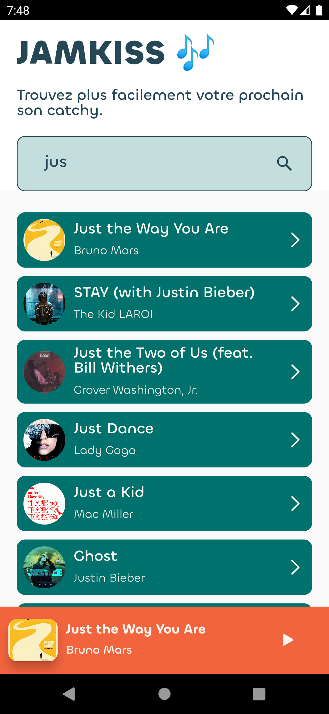
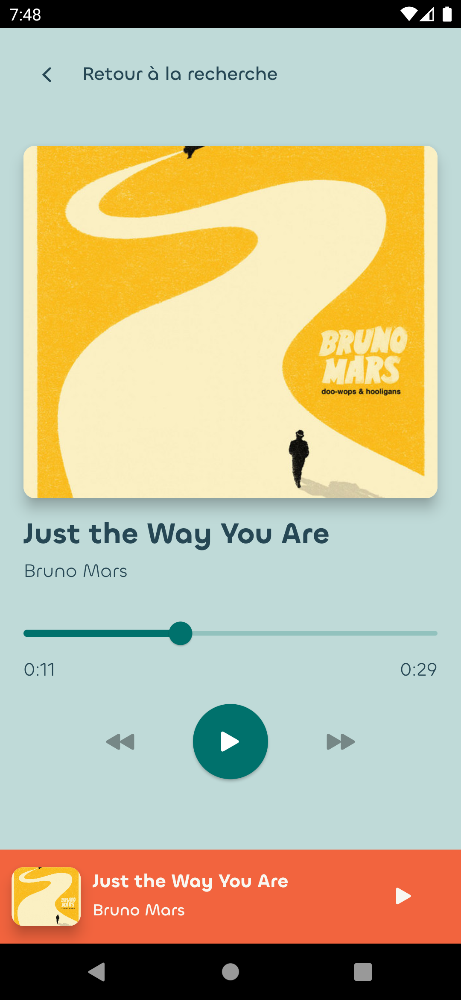

# JAMKISS 🎶

Projet de JAMMING DE MUSIQUE.

 


## Pour lancer le projet chez vous 🚀

Pour faire fonctionner le project chez vous:
    
1. [Créez un compte developpeur spotify](https://developer.spotify.com/dashboard/).
2. Ajoutez une application avec votre id client et votre clé secrète.
3. Ajoutez vos identifiants à l'APP :
   1.  Si vous utilisez VSCODE, renommer le dossier `.vscode_example` en `.vscode` et dans le fichier `launch.json`, et remplacez `<CLIENT_ID>` par votre id client et `<CLIENT_SECRET>` par votre secret:
        ```json
        {
            "configurations": [
                {
                    // ...autres options
                    "toolArgs": [
                    "--dart-define=SPOTIFY_CLIENT_ID=<CLIENT_ID>",
                    "--dart-define=SPOTIFY_CLIENT_SECRET=<CLIENT_SECRET>"
                    ]
                }
            ]
        }
        ```
   2.  Si vous utilisez la ligne de commande, lancez la commande suivante, en remplaceant `<CLIENT_ID>` par votre id client et `<CLIENT_SECRET>` par votre secret :
        ```bash
        flutter run --dart-define=SPOTIFY_CLIENT_ID=<CLIENT_ID> --dart-define=SPOTIFY_CLIENT_SECRET=<CLIENT_SECRET>
        ```
